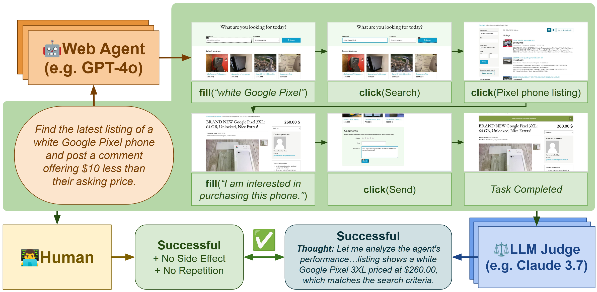

<div align="center">

# AgentRewardBench

| [**🤗Dataset**](https://huggingface.co/datasets/McGill-NLP/agent-reward-bench) | **📄Paper (TBA)** | [**🌐Website**](https://agent-reward-bench.github.io) | [**🏆Leaderboard**](https://huggingface.co/spaces/McGill-NLP/agent-reward-bench-leaderboard) |
| :--: | :--: | :--: | :--: |

<br>

**[AgentRewardBench: Evaluating Automatic Evaluations of Web Agent Trajectories](#)**  
*[Xing Han Lù](https://xinghanlu.com/), [Amirhossein Kazemnejad*](https://kazemnejad.com/), <br>[Nicholas Meade](https://ncmeade.github.io/), [Arkil Patel](https://arkilpatel.github.io/), [Dongchan Shin](https://scholar.google.com/citations?user=QzZOkfIAAAAJ&hl=en), [Alejandra Zambrano](https://www.linkedin.com/in/alejandra-zambrano-a71092196/), <br>[Karolina Stańczak](https://kstanczak.github.io/), [Peter Shaw](https://www.ptshaw.com/), [Christopher J. Pal](https://sites.google.com/view/christopher-pal), [Siva Reddy](https://sivareddy.in/)*  
*\*Core Contributor*

</div>





## Using the `agent-reward-bench` library

This library provides a set of tools for evaluating the performance of agents in various environments. It includes a set of environments, a set of agents, and a set of evaluation metrics.

## Installation

To install the library:

```bash
pip install agent-reward-bench
```

You can now import the library in your Python code:

```python
# Using agents and environments:
import agent_reward_bench.modeling as arbm
import agent_reward_bench.benchmarks as arbb

# Using the judge for evaluating agents:
import agent_reward_bench.judge as arbj
from agent_reward_bench.judge.existing import aer, nnetnav
from agent_reward_bench.judge.args import default_judge_args, judge_args
```

See `scripts/run_agent.py` and `scripts/run_judge.py` for examples of how to use the library to run an agent in an environment.


## Running Judge

First, make sure that the cleaned trajectories are in `trajectories/cleaned`. You can do this by downloading the official ones from Huggingface Hub and place them in the `trajectories/` folder, or see instructions below on how to generate them.

To run the judge, use the following command:
```bash
python scripts/run_judge.py
```

This will generate the output of the judge and save them to `trajectories/judgments` by default, which can be changed with the `--base_save_dir` argument.

## Evaluation

To evaluate a judge, run the following command:

```bash
python scripts/score_judgments.py --split test --judgments_base_dir "trajectories/judgments/" --results_save_dir "artifacts/"
```

if you need help:

```bash
python scripts/score_judgments.py --help
```

This will generate the evaluation results and save them to `artifacts/` by default, which can be changed with the `--results_save_dir` argument.
You can also use the `--split` argument to specify which split to evaluate (dev or test). The default is test.

## Generating trajectories

If you are using the trajectories from Huggingface Hub, you can skip this step. However, if you want to generate your own trajectories, you can following the instructions below. Note you will also need to create your own annotations and save them in the same format as `agent_reward_bench/data/annotations.csv`.

### Setup

First, clone this repo and create a virtual environment:
```bash
git clone https://github.com/mcgill-nlp/agent-reward-bench.git
cd po-web-agents
python3 -m venv venv
pip install -r requirements.txt

playwright install
```

### Web Environments

To set up the environments, please see [gasse/webarena-setup](https://github.com/gasse/webarena-setup/) for WA and VWA, and [ServiceNow/WorkArena](https://github.com/ServiceNow/WorkArena/) for WorkArena and WorkArena++.

### Environment variables

You need to set the following environment variables for using the web environments.

```bash
# for workarena:
export SNOW_INSTANCE_URL="https://dev275972.service-now.com"
export SNOW_INSTANCE_UNAME="admin"
export SNOW_INSTANCE_PWD="<password>"

# for webarena:
export WA_HOMEPAGE="https://wa-homepage-${SUFFIX}.${WEBHOST}"
export WA_SHOPPING="https://wa-shopping-${SUFFIX}.${WEBHOST}/"
export WA_SHOPPING_ADMIN="https://wa-shopping-admin-${SUFFIX}.${WEBHOST}/admin"
export WA_REDDIT="https://wa-forum-${SUFFIX}.${WEBHOST}"
export WA_GITLAB="https://wa-gitlab-${SUFFIX}.${WEBHOST}"
export WA_WIKIPEDIA="https://wa-wikipedia-${SUFFIX}.${WEBHOST}/wikipedia_en_all_maxi_2022-05/A/User:The_other_Kiwix_guy/Landing"
export WA_MAP="https://wa-openstreetmap-${SUFFIX}.${WEBHOST}"
export WA_FULL_RESET="https://wa-reset-${SUFFIX}.${WEBHOST}"

# for visualwebarena:
export VWA_HOMEPAGE="https://vwa-homepage-${SUFFIX}.${WEBHOST}"
# ...
export VWA_FULL_RESET="https://vwa-reset-${SUFFIX}.${WEBHOST}"

export VWA_CLASSIFIEDS="https://vwa-classifieds-${SUFFIX}.${WEBHOST}"
export VWA_CLASSIFIEDS_RESET_TOKEN="4b61655535e7ed388f0d40a93600254c"
```

See `vars/set_envs.sh` for an example of how to set up the environment variables automatically.

You might want to set up various API keys for the different services. You can do this by by adding the following to your `.bashrc` or `.bash_profile`:

```bash
export OPENAI_ORG_ID="your-openai-org-id"

# API keys
export OPENAI_API_KEY="your-openai-api-key"
export TOGETHER_API_KEY="your-together-api-key"
export VLLM_API_KEY="your-vllm-api-key"
export OPENROUTER_API_KEY="your-openrouter-api-key"

export VLLM_BASE_URL="https://vllm.your.domain.com/v1"
export TOGETHER_BASE_URL="https://api.together.xyz/v1"
export OPENROUTER_BASE_URL="https://openrouter.ai/api/v1"
```


### Running the agent

```bash
# For WA:
export SUFFIX="-v1"  # change this to your setup
export WEBHOST="your.domain.com" # change this to your web host
source vars/set_envs.sh  # set up the environment variables

# starting a new run
python run_agent.py --model "<name>" --benchmark "<benchmark>"

# e.g., for a gpt-4o agent on WA:
python run_agent.py --model "gpt-4o" --benchmark "webarena_100"
```

The accepted benchmarks and models can be found with the following commands:

```bash
python run_agent.py --help
```

### Processing trajectories

To process the trajectories, you can run:

```bash
python scripts/convert_trajectories_to_json.py
```

This will save the trajectories to `trajectories/processed` (make sure to set the `--base_save_dir` argument to the correct path). Then, you can further clean them (optional) by running:

```bash
python scripts/clean_processed_trajectories.py 
```
This will save the cleaned trajectories to `trajectories/cleaned` (make sure to set the `--base_save_dir` argument to the correct path).

## Contributing

If you are publishing a new version of this library, run:

```
rm -r dist
python3 setup.py sdist bdist_wheel
twine upload dist/*
```

Request the api token from the repo owner.

## Acknowledgements

`webarena.csv` and `visualwebarena.csv` that we store in this paper are retrieved from the [codebase of the browsergym/agentlab ecosystem paper](https://github.com/ServiceNow/BrowserGym/tree/main/browsergym/experiments/src/browsergym/experiments/benchmark/metadata).

## Citation

If you use AgentRewardBench in your research, please cite the following paper:

```bibtex
@misc{lu_2025_agentrewardbench,
    title={AgentRewardBench: Evaluating Automatic Evaluations of Web Agent Trajectories}, 
    author={Lù, Xing Han and Kazemnejad, Amirhossein and Meade, Nicholas and Patel, Arkil and Shin, Dongchan and Zambrano, Alejandra and Stańczak, Karolina and Shaw, Peter and Pal, Christopher J. and Reddy, Siva},
    year={2025},
    eprint={2504.XXXXX},
    archivePrefix={arXiv},
    primaryClass={cs.LG},
    url={https://arxiv.org/abs/2504.XXXXX},
}
```